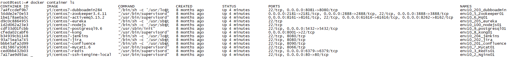

# Docker基本使用

><h3 style="padding:5px 0;">docker环境配置</h3>

**ubuntu18.10设置root密码**

```
sudo passwd
```

**ubunbu18.10允许root登录**

```Shell
sudo vi /etc/sshd/sshd_config
# 加入: PermitRootLogin yes
reboot
```

**为docker添加国内镜像**

```Shell
sudo vi /etc/apt/sources.list
# 加入如下内容
deb http://mirrors.163.com/ubuntu/ artful main restricted universe multiverse
deb http://mirrors.163.com/ubuntu/ artful-security main restricted universe multiverse
deb http://mirrors.163.com/ubuntu/ artful-updates main restricted universe multiverse
deb http://mirrors.163.com/ubuntu/ artful-proposed main restricted universe multiverse
deb http://mirrors.163.com/ubuntu/ artful-backports main restricted universe multiverse
deb http://mirrors.163.com/ubuntu/ bionic main restricted universe multiverse
deb http://mirrors.163.com/ubuntu/ bionic-security main restricted universe multiverse
deb http://mirrors.163.com/ubuntu/ bionic-updates main restricted universe multiverse
deb http://mirrors.163.com/ubuntu/ bionic-proposed main restricted universe multiverse
deb http://mirrors.163.com/ubuntu/ bionic-backports main restricted universe multiverse
deb http://mirrors.163.com/ubuntu/ cosmic main restricted universe multiverse
deb http://mirrors.163.com/ubuntu/ cosmic-security main restricted universe multiverse
deb http://mirrors.163.com/ubuntu/ cosmic-updates main restricted universe multiverse
deb http://mirrors.163.com/ubuntu/ cosmic-proposed main restricted universe multiverse
deb http://mirrors.163.com/ubuntu/ cosmic-backports main restricted universe multiverse
deb http://mirrors.163.com/ubuntu/ disco main restricted universe multiverse
deb http://mirrors.163.com/ubuntu/ disco-security main restricted universe multiverse
deb http://mirrors.163.com/ubuntu/ disco-updates main restricted universe multiverse
deb http://mirrors.163.com/ubuntu/ disco-proposed main restricted universe multiverse
deb http://mirrors.163.com/ubuntu/ disco-backports main restricted universe multiverse
deb http://mirrors.163.com/ubuntu/ trusty main restricted universe multiverse
deb http://mirrors.163.com/ubuntu/ trusty-security main restricted universe multiverse
deb http://mirrors.163.com/ubuntu/ trusty-updates main restricted universe multiverse
deb http://mirrors.163.com/ubuntu/ trusty-proposed main restricted universe multiverse
deb http://mirrors.163.com/ubuntu/ trusty-backports main restricted universe multiverse
deb http://mirrors.163.com/ubuntu/ xenial main restricted universe multiverse
deb http://mirrors.163.com/ubuntu/ xenial-security main restricted universe multiverse
deb http://mirrors.163.com/ubuntu/ xenial-updates main restricted universe multiverse
deb http://mirrors.163.com/ubuntu/ xenial-proposed main restricted universe multiverse
deb http://mirrors.163.com/ubuntu/ xenial-backports main restricted universe multiverse
```

**安装docker**

```
    # 更新apt-get
    apt-get update
    # 安装docker
    apt-get install docker-io
    # 启动docker服务
    service docker start
    # 查看docker版本
    docker version -v
    # 为容器创建网络
    docker network create -d bridge --subnet 192.168.10.0/24 env10
    # 加载镜像
    docker load < yi/centos7-activemq5.15.2
```

**创建docker容器**

```
docker run -d -p 8161:8161 -p 8262:8162 -p 61616:61616 --net=env10 --ip=192.168.10.6 --restart=always --name env10_6_Mq01 yi/centos7-activemq5.15.2
```

tomcat为镜像文件，tomcat-test为新建的容器的名字，通过这个名字可以针对性的管理这个容器。

**查看运行中的docker容器**

```Shell
docker container ls
```



**切入某一个docker容器**

```Shell
# 切入
docker exec -it env10_6_Mq01 /bin/bash
# 退出docker容器
exit
```

**从docker容器下载文件**

```Shell
docker cp env10_203_dubboadmin:/usr/local/apache-tomcat-7.0.92/webapps/dubbo-governance.log ./
```

**导出docker容器**

```Shell
docker export env10_203_dubboadmin > env10_203_dubboadmin.tar
```

**导入docker容器**

```Shell
cat env10_203_dubboadmin.tar | docker import test/env10_203_dubboadmin
```

> <h3 style="padding:5px 0;">抢购平台配置</h3>

**启动消息队列**

```Shell
# 切入docker容器
docker exec -it env10_6_Mq01 /bin/bash
# 启动消息队列
./apache-activemq-5.15.2/bin/activemq start
```

**启动Zookeeper注册中心**

```Shell
/usr/local/zookeeper-3.4.12/bin/zkServer.sh start
```

**启动dubbo**

```
/usr/local/apache-tomcat-7.0.92/bin/startup.sh
```


